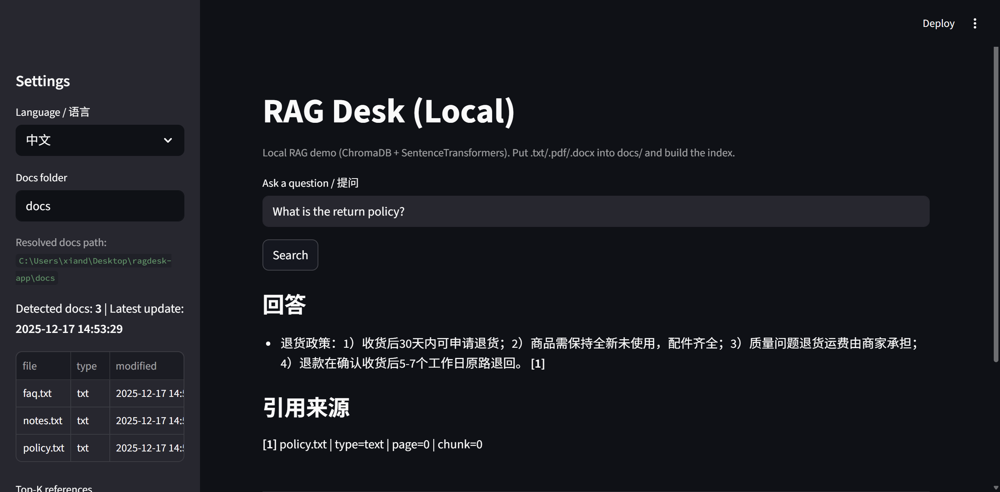

# RAG Desk (Local) — Bilingual RAG Desktop Web App

A **privacy-first, local** Retrieval-Augmented Generation (RAG) demo built with **Streamlit + ChromaDB + SentenceTransformers**.  
Drop documents into `/docs`, **one-click rebuild** the index in the browser, and ask questions with **citation-style sources**.  
Supports **English & 中文** UI/answers.

> ✅ Best for: internal SOP / policy Q&A, small knowledge base search, bilingual document retrieval (local-first).

---

## ⭐ 10-second overview

- **Run**: Double-click `Start_RAGDesk.bat` → open `http://localhost:8501`
- **Add docs**: Put `.txt` (and optionally `.pdf/.docx if enabled) into `docs/`
- **Index**: Click **Build / Rebuild Index**
- **Ask**: Query in English or Chinese → get a concise answer + citations (file/page/chunk)

---

## 🔥 Project Highlights (Resume-ready)

- Built a **local bilingual RAG** desktop web app (Streamlit) with **ChromaDB vector store** + **multilingual embeddings**.
- Implemented **one-click indexing** from a `/docs` folder and **citation-style references** (file/page/chunk) for traceability.
- Added a **Windows-friendly launcher** (`Start_RAGDesk.bat`) to support non-technical users (no notebook required).

---

## ✨ Features

- Local-first RAG (**no cloud required**)
- Drag-and-drop / copy documents into `docs/`
- One-click **Build / Rebuild Index**
- Bilingual mode: **English / 中文**
- Citation-style sources: `file | type | page | chunk`
- Windows-friendly launcher: `Start_RAGDesk.bat`

---

## 🧠 How it works

1. Load documents from `docs/`
2. Chunk text and create embeddings (SentenceTransformers)
3. Store vectors in ChromaDB (local folder `chroma_db/`)
4. Retrieve top-k relevant chunks
5. Generate a concise answer + show citations

---

## 🖥️ Demo

### English


### 中文


**Example questions**
- EN: `What is the return policy?`
- 中文：`是否支持部分退货？`

Expected output: **short answer** + **1–3 relevant citations**.

---

## 🚀 Quick Start (Windows)

### Option A: Double-click (recommended)
1. Install **Anaconda / Miniconda**
2. Double-click `Start_RAGDesk.bat`
3. Open: `http://localhost:8501`
4. Put docs into `docs/` → click **Build / Rebuild Index** → ask questions

### Option B: Command line
```bash
conda activate ragdesk
cd %USERPROFILE%\Desktop\ragdesk-app
pip install -r requirements.txt
python -m streamlit run app.py
